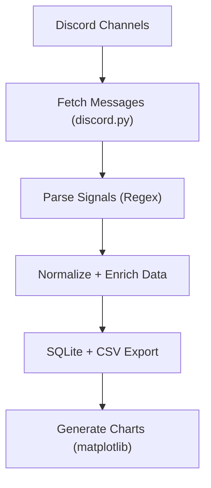

# Discord → Data → Decisions  
### Automated Trade Signal Parser & Analyzer

**Goal:** Turn noisy trading chatter into clean, analyzable datasets.

This AI-powered pipeline automatically:
-  Extracts structured alerts from Discord
-  Cleans and normalizes text for consistency
-  Stores results in a local/remote database
-  Generates visual summaries for quick insights

Next step: **ML-based performance scoring** for predictive signal quality.

---

### Tech Stack
- Python • Pandas • Matplotlib • Regex • SQLite  
- Discord API • Data Cleaning Pipelines • Automation via GitHub Actions  

---

### Use Case
Designed for fintech engineers, AI developers, and data enthusiasts who want to:
- Build ML-ready trading datasets  
- Automate Discord/Telegram signal tracking  
- Create analytics dashboards for trade accuracy  

---

### Future Roadmap
- ML Scoring System (signal reliability)
- Hugging Face Integration (ETL demo space)
- Cloud-based visualization dashboard  

---

**“From Discord noise to actionable data — automatically.”**


---

## Pipeline Overview

---

## Quickstart

### Create Virtual Environment
```bash
python -m venv venv
# Windows
venv\Scripts\activate
# macOS / Linux
source venv/bin/activate
```

### Install Dependencies
```bash
pip install -r requirements.txt
```

### Set Environment Variables
Create a `.env` file in the project root:
```bash
DISCORD_BOT_TOKEN=your_discord_bot_token
CHANNEL_IDS=123456789012345678,234567890123456789
```

---

## Running the Pipeline

### Fetch Discord Messages
Pull all messages from your specified alert channels:
```bash
python src/ingest/fetch_messages.py
```
> Outputs raw data → `data/raw/discord_messages.csv`

---

### Parse, Clean & Export
Transform raw messages into structured datasets:
```bash
python main.py
```
> Outputs:
> - Clean CSV → `data/clean/trade_signals.csv`  
> - SQLite DB → `data/clean/trade_signals.db`  
> - Charts → `data/charts/`

---

## Generated Analytics

| Chart | Description |
|-------|--------------|
| `ticker_frequency.png` | Alerts per ticker |
| `signal_strength_dist.png` | Distribution of 🔥 / ♻️ / 💀 signal strengths |
| `call_put_ratio.png` | Ratio of CALL vs PUT alerts |

---

## Data Model

| Column | Description |
|--------|--------------|
| `alert_type` | call / put / exit |
| `ticker` | Stock or ETF symbol |
| `comment` | Optional strategy or sentiment text |
| `timestamp`, `date`, `time` | Parsed TradingView alert time |
| `price` | Reported entry/exit price |
| `channel` | Source Discord channel |
| `signal_strength` | A+, Pullback, Exit, Neutral |
| `is_call` / `is_put` | Boolean helpers |

---

## SQLite Schema Example

```sql
CREATE TABLE signals (
    alert_type TEXT,
    ticker TEXT,
    comment TEXT,
    timestamp TEXT,
    date TEXT,
    time TEXT,
    price REAL,
    channel TEXT,
    signal_strength TEXT,
    is_call INTEGER,
    is_put INTEGER
);
CREATE INDEX idx_signals_ticker_date ON signals(ticker, date);
```

---

## Tech Stack
- **Python 3.11–3.13**
- **discord.py** – message ingestion  
- **pandas** – data cleaning  
- **matplotlib** – analytics visualization  
- **SQLite** – lightweight structured storage  
- **dotenv** – secret management  

---

## Next Steps
- [ ] Add live Discord → DB auto-sync (scheduled)  
- [ ] Integrate Hugging Face dataset + Space visualization  
- [ ] Enable webhook alerts on ETL completion  

---

## Credits
Built by **DeAndrai Mullen** — for financial analytics, compliance, and cloud automation.
